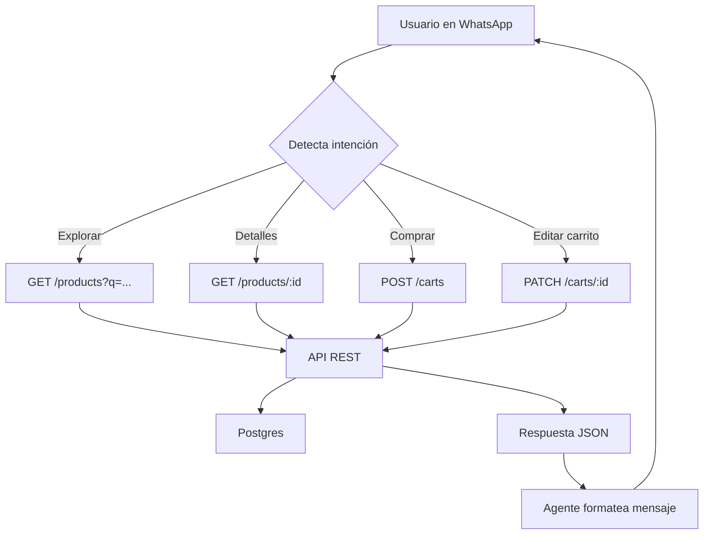
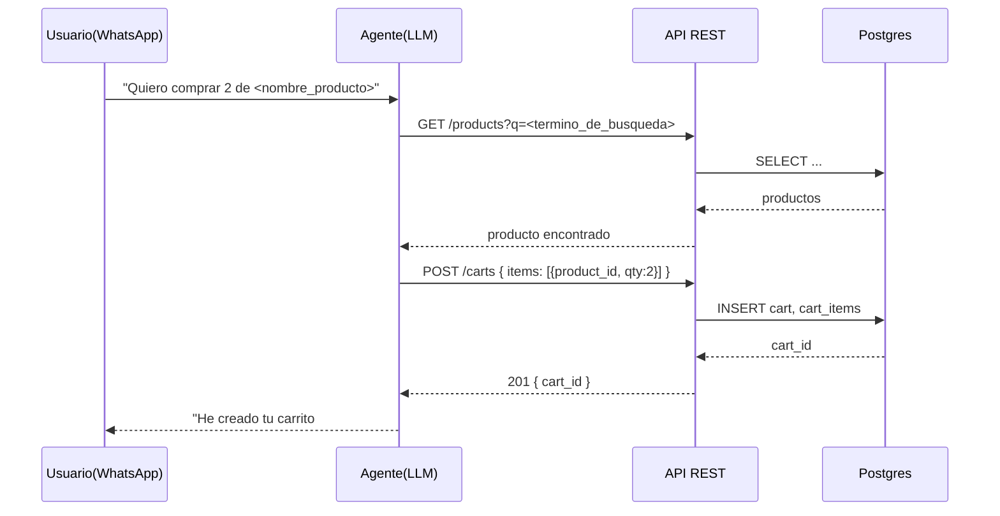

# Diagramas (Mermaid)

## Flowchart: agente atendiendo cliente

```mermaid
flowchart TD
  A[Usuario en WhatsApp] --> B{Detecta intención}
  B -- "Explorar" --> C[GET /products?q=...]
  B -- "Detalles" --> D[GET /products/:id]
  B -- "Comprar" --> E[POST /carts]
  B -- "Editar carrito" --> F[PATCH /carts/:id]
  C --> G[API REST]
  D --> G
  E --> G
  F --> G
  G --> H[Postgres]
  G --> I[Respuesta JSON]
  I --> J[Agente formatea mensaje]
  J --> A
```

## Sequence: compra básica

```mermaid
sequenceDiagram
  participant U as Usuario(WhatsApp)
  participant AG as Agente(LLM)
  participant API as API REST
  participant DB as Postgres

  U->>AG: "Quiero comprar 2 de <nombre_producto>"
  AG->>API: GET /products?q=<termino_de_busqueda>
  API->>DB: SELECT ...
  DB-->>API: productos
  API-->>AG: producto encontrado
  AG->>API: POST /carts { items: [{product_id, qty:2}] }
  API->>DB: INSERT cart, cart_items
  DB-->>API: cart_id
  API-->>AG: 201 { cart_id }
  AG-->>U: "He creado tu carrito #42. Total: $... ¿Confirmas?"
```
